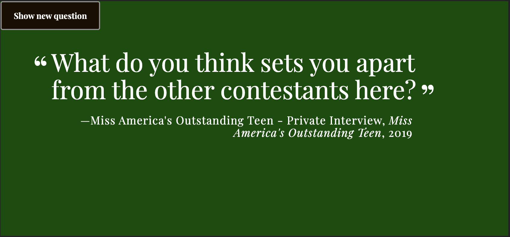

# A Random Interview Question Generator

## How to use this Project

From your terminal, download the files using

```
$ git clone https://github.com/drewwmercer/interview-generator.git
```

A virtual environment is a tool that helps to keep dependencies required by
different projects separate from each other by using isolated virtual environments.
The venv module comes pre installed with Python 3.5 + versions.
Create your virtual environment

```
$ python3 -m venv env
$ source env/bin/activate
```

I created the requirements.txt file using the pip freeze command.
Install all dependencies from the requirements.txt file.

```
$ pip3 install -r requirements.txt
```

Run the app.py file

```
$ python3 app.py
```

Type in http://localhost:3000 into your browser to view the project live.
Type in CTRL-C to stop running the server.

To deactivate your environment:

```
$ deactivate
```

<br />

## About this Project

HTML, CSS, and Python Flask were used for this project. The backend was written with some modifications to the CSS. All of the questions are fetched from an external json file. When the user clicks the "Show new question" button on the top left of the screen, a new question displays. The question includes the background information from where it was sourced.



### How to test this project on different screen sizes at the same time

Because I specified <b>host='0.0.0.0'</b> in the app.py file, you can view this project on other computers on the same network using the

- IP address of the computer running the server
- the port number (this project uses port 3000).
  <br />
  For example, if the IP address of the computer running the server is 192.147.1.113, this is what you would need to type into the browser:<br />
  192.147.1.113:3000
